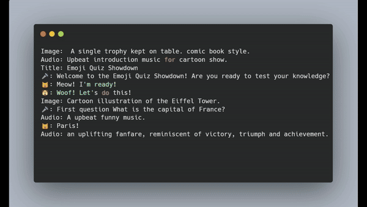

# Emoji Video Generator


The objective of this project was to develop a straightforward system capable of converting a basic script stored in a text file into a video. The aim was to ensure simplicity to the extent that even individuals with a bit of creativity and typing skills could produce a movie effortlessly. This tool is designed to operate smoothly on a computer with 8 GB of memory, offering reasonable processing speeds even without GPUs. While initially intended for entertainment with GenAI, I believe that, in capable hands, it holds the potential to generate pretty cool content. This project is experimental in nature, crafted primarily for educational purposes

> This software is intended solely for educational purposes. It is used at your own discretion and risk. Please be aware that the AI models utilized in this code may have restrictions against commercial usage.

## Installation


```bash
sudo apt update
sudo apt install espeak ffmpeg

```

```bash
git clone https://github.com/code2k13/emoji_vid_gen
cd emoji_vid_gen
wget https://github.com/googlefonts/noto-emoji/raw/main/fonts/NotoColorEmoji.ttf
```


```bash
pip install -r requirements.txt
```

## Sample script

```bash
Image: Cartoon illustration showing a beautiful landscape with mountains and a road.
Audio: Tranquil calm music occasional chirping of birds.
Title: EmojiVidGen
🐼: Emoji vid gen is a tool to create videos from text files using AI.
```


## How to run

```bash
python generate_video.py scripts/hello.txt hello.mp4
```

## A full featured example

```bash
Image:  A single trophy kept on table. comic book style.
Audio: Upbeat introduction music for cartoon show.
Title: Emoji Quiz Showdown
🎤: "Welcome to the Emoji Quiz Showdown! Are you ready to test your knowledge?"
🐱: "Meow! I'm ready!"
🐶: "Woof! Let's do this!"
Image: Cartoon illustration of the Eiffel Tower.
🎤: "First question What is the capital of France?"
Audio: suspenseful music playing.
🐱: "Paris!"
Audio: people applauding sound
Image: Cartoon illustration of Mount Everest.
🎤: "Correct! One point for the cat! Next question  What is the tallest mountain in the world?"
Audio: suspenseful music playing.
🐶: "Mount Everest!"
Audio: people applauding sound
Image: Cartoon illustration of a water molecule.
🎤: "Right again! One point for the dog! Next question  What is the chemical symbol for water?"
Audio: suspenseful music playing.
🐱: "H2O!"
Audio: people applauding sound
Image: Cartoon illustration of a globe with seven continents.
🎤: "Correct! Another point for the cat! Last question How many continents are there on Earth?"
Audio: suspenseful music playing.
🐶: "Seven!"
Audio: people applauding sound
🎤: "Correct! It's a tie! You both did great! Thanks for playing the Emoji Quiz Showdown!"
```

## Use high quality text to image (SDXL-Turbo)(Recommended)

Create .env file if not present and add set following variable. 
Warning: You will need at least 16 GB RAM.
```bash
USE_SD_TURBO_XL=true
```

## Using high quality TTS (Bark):

Create .env file if not present and add set following variable. 
Warning: This is super slow on CPU.

```bash
TTS_HIGH_QUALITY=true
```

## Using GPU

Create .env file if not present and add set following variable

```bash
USE_CUDA=true
```

## Using pre-created assets

Ensure that asset files are present in .cache folder. Create the script in this manner

```bash
Image: .cache/existing_background_hd.png
Audio: Funny opening music jingle.
Title: EmojiVidGen
🐼: .cache/existing_speech.wav
```

## Change default width and height of image

The default resolution is 1280x720. To change it set the following environment  variables in .env file:

```bash
VIDEO_WIDTH=1152 
VIDEO_HEIGHT=896
```

Note: This setting does affect the output of stable diffusion. Not all resolutions work that well. For  more information checkout this
 https://replicate.com/guides/stable-diffusion/how-to-use/ . Stable Diffusion seems to work well with square aspect ratios.


## Known issues

You will see this error message when using default TTS engine. 

```bash
Traceback (most recent call last):
  File "/usr/local/lib/python3.10/dist-packages/pyttsx3/drivers/espeak.py", line 171, in _onSynth
    self._proxy.notify('finished-utterance', completed=True)
ReferenceError: weakly-referenced object no longer exists
```

Ignore this error for now as it does not affect the output.