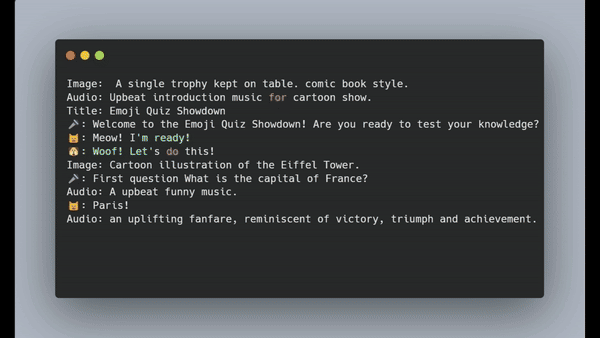

# Emoji Video Generator



EmojiVidGen is a fun tool that creates videos from text files. It takes input in the form of plain text files containing a script (similar to a story or dialogue). It then transforms this script into a stunning video. EmojiVidGen is based on a plugin system, which allows for experimenting with different models and languages. All you need is some imagination and typing skills !

Key Features
- Converts text files into visually appealing videos
- Automatically generates narration, images, and audio effects
- Designed to run smoothly on computers with 8 GB of memory, offering reasonable processing speeds even without GPUs
- Utilizes various Generative AI models for its tasks
- Built on a powerful plugin system, allowing for easy extensibility
- Switch between different models and spoken languages.

 
While initially intended for entertainment with GenAI, `EmojiVidGen` holds significant potential for producing engaging and cool content, especially in capable hands. This project is experimental and primarily crafted for educational purposes, exploring the possibilities of AI-powered video creation.

> This software is intended solely for educational purposes. It is used at your own discretion and risk. Please be aware that the AI models utilized in this code may have restrictions against commercial usage.

## Installation


```bash
sudo apt update
sudo apt install espeak ffmpeg

```

```bash
git clone https://github.com/code2k13/emoji_vid_gen
cd emoji_vid_gen
wget https://github.com/googlefonts/noto-emoji/raw/main/fonts/NotoColorEmoji.ttf
```


```bash
pip install -r requirements.txt
```

## Sample script

> Note: A script should always start with a `Image:` directive

```bash
Image: Cartoon illustration showing a beautiful landscape with mountains and a road.
Audio: Tranquil calm music occasional chirping of birds.
Title: EmojiVidGen
🐼: Emoji vid gen is a tool to create videos from text files using AI.
```


## How to run

```bash
python generate_video.py stories/hello.txt hello.mp4
```

## A full featured example

```bash
Image:  A single trophy kept on table. comic book style.
Audio: Upbeat introduction music for cartoon show.
Title: Emoji Quiz Showdown
🎤: "Welcome to the Emoji Quiz Showdown! Are you ready to test your knowledge?"
🐱: "Meow! I'm ready!"
🐶: "Woof! Let's do this!"
Image: Cartoon illustration of the Eiffel Tower.
🎤: "First question What is the capital of France?"
Audio: suspenseful music playing.
🐱: "Paris!"
Audio: people applauding sound
Image: Cartoon illustration of Mount Everest.
🎤: "Correct! One point for the cat! Next question  What is the tallest mountain in the world?"
Audio: suspenseful music playing.
🐶: "Mount Everest!"
Audio: people applauding sound
Image: Cartoon illustration of a water molecule.
🎤: "Right again! One point for the dog! Next question  What is the chemical symbol for water?"
Audio: suspenseful music playing.
🐱: "H2O!"
Audio: people applauding sound
Image: Cartoon illustration of a globe with seven continents.
🎤: "Correct! Another point for the cat! Last question How many continents are there on Earth?"
Audio: suspenseful music playing.
🐶: "Seven!"
Audio: people applauding sound
🎤: "Correct! It's a tie! You both did great! Thanks for playing the Emoji Quiz Showdown!"
```

## The Narrator
The emoji `🎙️` is reserved as narrator. Using it at start of line will cause the system to only generated sound and not output any image on background.

## Using presets

If you've followed the earlier instructions for video generation, you might have noticed that the default setup uses `espeak` as the text-to-speech engine, resulting in a robotic-sounding output. EmojiVidGen is built with an internal structure comprising of plugins, each capable of modifying how a task is executed or which model is used.

For instance, you can designate a specific plugin for each type of generation task—be it text-to-image, text-to-audio, or text-to-speech. Because each plugin operates with its unique model and method, configuring these settings individually can be overwhelming. To simplify this process, I've introduced the concept of presets. You can apply a preset by supplying the `--preset` option to the `generate_video.py` file.

For example the below preset uses a preset called `local_medium`.
```bash
python generate_video.py stories/hello.txt hello.mp4 --preset local_medium
```

All presets are stored in `./presets folder`. To create a new preset (say `custom_preset`), just create a new `custom_preset.yaml` file in `./presets' folder and start using it like this

```bash
python generate_video.py stories/hello.txt hello.mp4 --preset custom_preset
```

Note that the `voice`s used in `characters` section should be supported by the selected `text_to_speech` provider. Images should ideally be PNG files with square aspect ration and transparent background.

## Available Presets

| Preset Name | Description |
|-----------------|-----------------|
| openai_basic   | Uses OpenAI for text to speech (standard) and image generation (DALL-E 2 @ 512x512). Needs `OPENAI_API_KEY` environment variable to be populated  |
| openai_medium   | Similar to openai_basic but uses (DALL-E 3 @ 1024x1024). Needs `OPENAI_API_KEY` environment variable to be populated  |
| local_basic   | Uses Huggingface's Stable Diffusion pipeline with `stabilityai/sd-turbo` model for text to image. Uses `espeak` for text to speech and Huggingface's AudioLDM pipeline for text to audio.   |
| local_basic_gpu    | Same as local_basic, but with cuda support enabled.   |
| local_medium    | Similar to local_basic but uses `brave` as text to speech engine and `stabilityai/sdxl-turbo` model for text to image   |
| local_medium    | Same as local_medium, but with cuda support is enabled.   |
| eleven_medium    | Same as local_medium, but uses `ElevenLabs` text to speech API support is enabled. Needs internet and `ELEVEN_API_KEY` variable to be defined in `.env` file. Needs internet and ElevenLabs account.   |
| parler_medium    | Same as local_medium, but uses `parler` text to speech API support is enabled.|

## Configuring characters 
Sometimes you may not want to use emojis as characters in your video or use a different voice for each character. This can now be achieved using the `characters` section in preset yaml files. Given below is an example of how such a section might look like: 

```yaml
global:
  width: 512
  height: 512 
  use_cuda: "false"
  characters:
    - name: "🎤"
      voice: "fable"

    - name: "🐱"
      image: "/workspace/emoji_vid_gen/cat.png"
      voice: "alloy"

    - name: "🐶"
      image: "/workspace/emoji_vid_gen/dog.png"
      voice: "echo"

text_to_speech:
  provider: openai
  voice: Nova
```

## Creating custom presets

WIP


## About Cache

EmojiVidGen utilizes a cache mechanism to retain assets produced during video creation, each associated with the specific 'prompt' used. This feature proves highly beneficial, especially when iteratively refining videos, eliminating the need to regenerate assets repetitively. However, please be aware that the `.cache` directory is not automatically cleared. It's advisable to clear it upon completing a video project and beginning another.

> Tip: To force re-creation of cached assets make minorinor alterations to the 'prompt' such as adding a space or punctuation

## Using pre-created assets

Ensure that asset files are present in `.cache` folder. Create the script in this manner

```bash
Image: .cache/existing_background_hd.png
Audio: Funny opening music jingle.
Title: EmojiVidGen
🐼: .cache/existing_speech.wav
```

## Change default width and height of image

Copy a suitable preset file and modify following lines:

```yaml
global:
  width: 1152
  height: 896
```

Note: This setting does affect the output of stable diffusion. Not all resolutions work that well. For  more information checkout this
 https://replicate.com/guides/stable-diffusion/how-to-use/ . Stable Diffusion seems to work well with square aspect ratios.


## Known issues

You will see this error message when using `espeak` text to speech provider. 

```bash
Traceback (most recent call last):
  File "/usr/local/lib/python3.10/dist-packages/pyttsx3/drivers/espeak.py", line 171, in _onSynth
    self._proxy.notify('finished-utterance', completed=True)
ReferenceError: weakly-referenced object no longer exists
```

Ignore this error for now as it does not affect the output.


If you receive the below error, delete the `.cache` directory

```bash
  File "plyvel/_plyvel.pyx", line 247, in plyvel._plyvel.DB.__init__
  File "plyvel/_plyvel.pyx", line 88, in plyvel._plyvel.raise_for_status
plyvel._plyvel.IOError: b'IO error: lock .cache/asset/LOCK: Resource temporarily unavailable'
```

## Citation

```
@misc{lacombe-etal-2024-parler-tts,
  author = {Yoach Lacombe and Vaibhav Srivastav and Sanchit Gandhi},
  title = {Parler-TTS},
  year = {2024},
  publisher = {GitHub},
  journal = {GitHub repository},
  howpublished = {\url{https://github.com/huggingface/parler-tts}}
}
```

```
@misc{lyth2024natural,
      title={Natural language guidance of high-fidelity text-to-speech with synthetic annotations},
      author={Dan Lyth and Simon King},
      year={2024},
      eprint={2402.01912},
      archivePrefix={arXiv},
      primaryClass={cs.SD}
}
```
